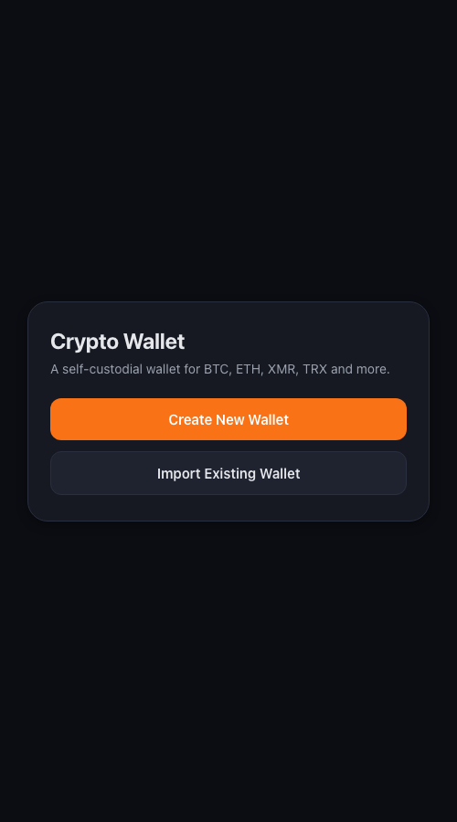
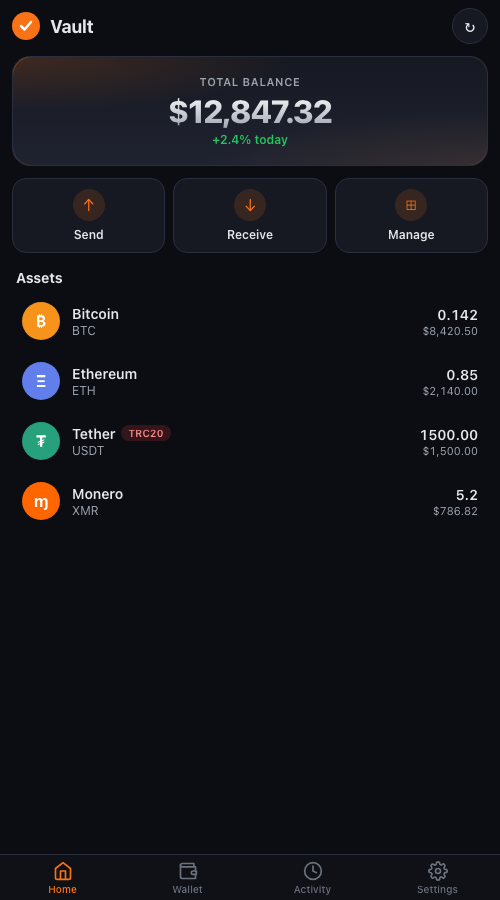
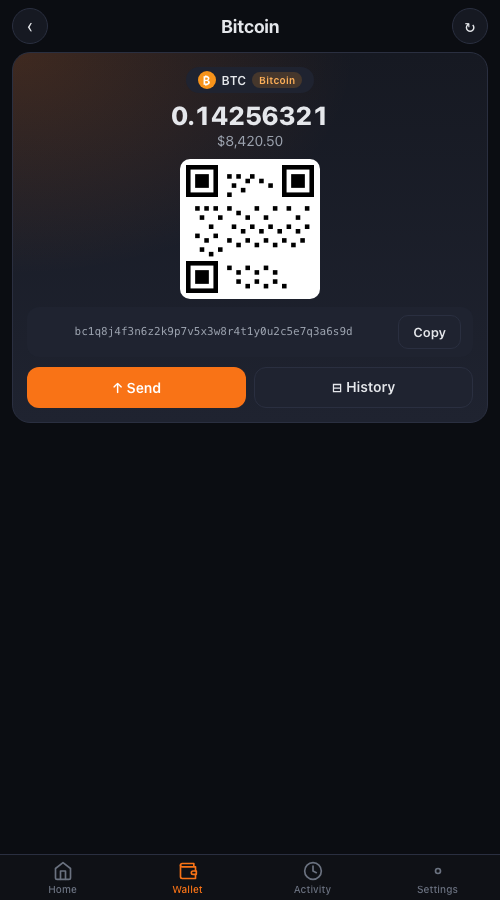

<div align="center">

# 🔐 Vault

### *Self-custodial, multi-chain, runs entirely on your phone.*

No server. No account. No third party. Your keys never leave your device.

<br>

[](https://satkiexe808.github.io/vault-wallet/)
[](https://github.com/SatkiExE808/vault-wallet/releases/latest)
[](#-build-ios-app)
[](https://capacitorjs.com/)
[](LICENSE)
[](#-security)

<br>

**🌐 Live PWA:** https://satkiexe808.github.io/vault-wallet/&nbsp;&nbsp;·&nbsp;&nbsp;**📱 Android APK:** [Latest release →](https://github.com/SatkiExE808/vault-wallet/releases/latest)

</div>

---

## 🖼️ Screenshots

<table>
<tr>
<td align="center" width="33%"><br><sub><b>Setup</b> · BIP39 seed creation / restore</sub></td>
<td align="center" width="33%"><br><sub><b>Home</b> · USD balance + asset list</sub></td>
<td align="center" width="33%"><br><sub><b>Coin Detail</b> · QR · send · history</sub></td>
</tr>
</table>

---

## ✨ Why Vault?

Most crypto wallets either ship as a heavy desktop binary (Exodus), tie you to one ecosystem (MetaMask is EVM-only, Phantom is Solana-only), or live in a browser extension you can't audit on mobile. **Vault is a single Capacitor PWA** that derives every chain from one BIP39 seed, runs every crypto operation locally in the browser (or via WASM for Monero), and works identically whether you sideload the APK or pin the PWA to your home screen.

| 🔑 Self-Custody | 🌐 Multi-Chain | 📱 Mobile-First | 🔒 Audited Crypto |
|---|---|---|---|
| Seed never leaves device | 13 chains, one seed | Bottom-nav UX | AES-256-GCM + PBKDF2 (600k) |
| No accounts / no signup | EVM + UTXO + Solana + Monero + TRON | One screen per action | Standard BIP39 / BIP44 / SLIP-44 |
| Biometric unlock | Standard derivation paths | Works as PWA or APK | Low-S sigs, bech32m enforced |
| Encrypted in `localStorage` | Aave V3 deposit/withdraw | Auto-updates over the air | Web Crypto API only |

---

## 🪙 Supported assets

| Chain | Native | Tokens | Derivation path |
|---|---|---|---|
| 🟧 Bitcoin | BTC (Native SegWit `bc1q…`) | — | `m/84'/0'/0'/0/0` |
| 🟪 Ethereum | ETH | USDT · USDC · DAI | `m/44'/60'/0'/0/0` |
| 🟨 BNB Chain | BNB | USDT · USDC | `m/44'/60'/0'/0/0` |
| 🟣 Polygon | POL | USDT · USDC | `m/44'/60'/0'/0/0` |
| 🔺 Avalanche | AVAX | USDT · USDC | `m/44'/60'/0'/0/0` |
| 🔵 Arbitrum | ARB · ETH | USDT · USDC | `m/44'/60'/0'/0/0` |
| 🔴 Optimism | OP · ETH | USDT · USDC | `m/44'/60'/0'/0/0` |
| 🔷 Base | ETH | USDT · USDC | `m/44'/60'/0'/0/0` |
| 🟥 TRON | TRX | USDT (TRC-20) | `m/44'/195'/0'/0/0` |
| 🟢 Solana | SOL | — | `m/44'/501'/0'/0'` |
| 🟠 Monero | XMR | — | derived from BIP39 |
| ⬛ Litecoin | LTC (Native SegWit `ltc1q…`) | — | `m/84'/2'/0'/0/0` |
| 🐕 Dogecoin | DOGE | — | `m/44'/3'/0'/0/0` |

---

## 🚀 Features

### 📱 Mobile-first UX
- Bottom nav: **Home** / **Wallets** / **Settings** — one screen per tab, no nested menus
- Pull-to-refresh balances
- Camera **QR scanner** for paste-free address entry

### 🏠 Home tab
- Total USD balance + asset list grouped by network
- **Edit mode** to reorder networks
- Hide / show individual tokens or chains

### 💸 Send & receive
- One-tap **QR receive** for any coin
- Inline **send form** — never leaves the coin detail page
- Auto gas-fee estimation (including L2 rollup data-fee component)
- **Auth-on-send** — every signature gated by biometric or password

### 🔓 Authentication
- **Face ID / fingerprint** unlock via native Capacitor BiometricAuth (Android / iOS) or WebAuthn (browser PWA)
- Per-install AES-256 envelope for the password — biometric is the gate, not the key itself
- **Recovery phrase reveal** — password-gated 12-word display
- **Change password** — re-encrypts the seed in place with round-trip verification (no possible data loss)

### 📜 History
- Recent transactions per chain
- One-tap link to the network's block explorer (Etherscan / Tronscan / mempool.space / etc.)

### 🌾 DeFi (Aave V3)
- Deposit / withdraw USDC, USDT, DAI on Polygon · Arbitrum · Optimism · Avalanche · Base · BSC
- Live APY readout

### 📲 Distribution
- **Installable PWA** — `Add to Home Screen` from any modern browser
- **Signed Android APK** in [Releases](https://github.com/SatkiExE808/vault-wallet/releases/latest)
- **Auto-updates** — APK `server.url` points at GitHub Pages, so pushing to `main` propagates HTML/CSS/JS without an APK reinstall

---

## 🔒 Security

> ⚠️ **Use at your own risk.** This wallet is not professionally audited. Test with small amounts first.

### Key handling
- BIP39 seed phrase encrypted with **AES-256-GCM**
- Encryption key derived from your password via **PBKDF2-SHA256, 600,000 iterations** (legacy v1 blobs at 300k decrypt and are upgraded on next unlock)
- Raw seed never persists — only the encrypted blob touches `localStorage`
- **Round-trip decryption** verified before any legacy plaintext is discarded — eliminates the seed-loss class of bug
- All key derivation runs locally using BIP39 / BIP44 / SLIP-44 (coin types 0, 2, 3, 60, 195, 501)

### Signing
- **EVM**: standard `secp256k1` ECDSA, MetaMask-compatible derivation
- **UTXO** (BTC / LTC / DOGE): **low-S signature normalization** to prevent transaction-malleability attacks
- **Bech32m** enforced per BIP350 — Taproot (`bc1p…`) addresses with correct checksum accepted, segwit v0 still uses bech32
- **Solana**: ed25519 via `tweetnacl`
- **Monero**: stagenet/mainnet via the [`monero-javascript`](https://github.com/woodser/monero-javascript) WASM bundle

### Biometric path
- Password is encrypted with a per-install AES-256 key
- The biometric (native iOS Keychain / Android BiometricPrompt or WebAuthn) gates retrieval of that key
- No biometric data ever leaves the device

### Privacy trade-offs you should know
- **Public RPCs** — every chain queries a public endpoint (blockstream.info · mempool.space · publicnode · llamarpc · etc.). They can correlate the IP making the request with the wallet address. None are user-configurable today.
- **Monero balance** uses **MyMonero**'s light-wallet API, which receives your *view key* (it's the price of not running a full Monero node in the browser). View key reveals incoming outputs to you only — it cannot sign. Sends use a real Monero node + WASM scan, no view-key leak.
- **Fee oracles** (mempool.space, BlockCypher) are capped in code so a compromised oracle can't make you broadcast a transaction that burns the whole UTXO on fees.

---

## ⚡ Run in browser

The wallet uses the Web Crypto API (`crypto.subtle`), which requires a **secure context** (HTTPS or `localhost`):

```bash
# Python
python3 -m http.server 8080

# Node
npx serve .
```

Open `http://localhost:8080`. Use the browser's *Add to Home Screen* to install as a PWA.

---

## 🤖 Build Android APK

<details><summary><b>Prerequisites</b></summary>

- [Node.js](https://nodejs.org) v18+
- [Android Studio](https://developer.android.com/studio) with Android SDK + bundled JDK
</details>

### Debug build

```bash
npm install
node build-www.js
npx cap sync android
cd android && ./gradlew assembleDebug
```

→ `android/app/build/outputs/apk/debug/app-debug.apk`

### Signed release build

<details><summary><b>1. Generate a keystore (one-time)</b></summary>

```bash
keytool -genkey -v \
  -keystore android/vault-release.keystore \
  -storetype PKCS12 \
  -keyalg RSA -keysize 2048 -validity 10000 \
  -alias vault
```
</details>

<details><summary><b>2. Create <code>android/keystore.properties</code> (gitignored)</b></summary>

```properties
storeFile=vault-release.keystore
storePassword=<your password>
keyAlias=vault
keyPassword=<your password>
```
</details>

<details><summary><b>3. Build</b></summary>

```bash
cd android
./gradlew assembleRelease
```

→ `android/app/build/outputs/apk/release/app-release.apk`
</details>

> 🔑 **Keep `vault-release.keystore` and its password backed up safely** — without them you can never push signature-matching updates.

### Updating the live web build

The APK has `server.url` pointing at the GitHub Pages URL, so pushes to `main` reach the installed app on next launch — no APK rebuild needed for HTML/CSS/JS updates.

---

## 🍎 Build iOS app

The repo is already configured for iOS via Capacitor — you just need to generate the Xcode project locally and build. **Build environment must be macOS** with Xcode + CocoaPods.

<details><summary><b>Prerequisites</b></summary>

- macOS with [Xcode](https://apps.apple.com/app/xcode/id497799835) (free, ~30 GB)
- [CocoaPods](https://cocoapods.org/): `brew install cocoapods` (or `sudo gem install cocoapods`)
- [Node.js](https://nodejs.org) v18+
- For sideloading to your own iPhone: a free Apple ID is enough (7-day signing expiration)
- For TestFlight / App Store: [Apple Developer Program](https://developer.apple.com/programs/) ($99/year)
</details>

### Scaffold the iOS project (one-time)

```bash
npm install                  # installs @capacitor/ios
node build-www.js            # populates www/
npx cap add ios              # generates ios/ folder with Xcode project
```

The `ios/` directory is gitignored on purpose — same pattern as `android/`. The shape is `ios/App/App.xcworkspace` (open this in Xcode, **not the .xcodeproj**, because of CocoaPods).

### Required Info.plist permissions

After `npx cap add ios`, edit `ios/App/App/Info.plist` and add these keys (Vault needs camera for the QR scanner and Face ID for biometric unlock):

```xml
<key>NSCameraUsageDescription</key>
<string>Vault uses the camera to scan QR codes when sending crypto.</string>
<key>NSFaceIDUsageDescription</key>
<string>Vault uses Face ID to unlock your wallet and authorize transactions.</string>
```

### Build

```bash
npm run sync:ios             # webpack → www → ios/App/App/public
npm run open:ios             # opens Xcode at ios/App/App.xcworkspace
```

In Xcode:
1. Select your iPhone (connect via cable or have it on the same Wi-Fi with developer mode enabled in Settings → Privacy & Security)
2. Set the **Signing Team** under *Signing & Capabilities* (your free Apple ID works)
3. Click **▶ Run**

Free Apple ID = build re-signs every 7 days. Paid Apple Developer Program = lifetime + TestFlight + App Store eligibility.

### Updating the live iOS web build

Same as Android — `server.url` points at GitHub Pages, so pushes to `main` reach the iOS app on next launch without rebuilding the IPA.

### App Store note

Apple has rejected many self-custodial wallet apps under the "unregulated financial transactions" guideline. If you plan to publish to the App Store rather than sideload, expect review back-and-forth. TestFlight is a safer first audience.

---

## 📂 Project structure

```
vault-wallet/
├── index.html               · App shell
├── manifest.json            · PWA manifest
├── sw.js                    · Service worker (network-first)
├── capacitor.config.json    · Capacitor / Android config
├── build-www.js             · Copies app files → www/
├── css/style.css
├── js/
│   ├── app.js               · Main logic, coin registry, send/receive flow
│   ├── home.js              · Home / Wallets rendering + routing
│   ├── settings.js          · Settings menu, biometric, password change
│   ├── tx-progress.js       · Send-tx progress UI
│   ├── qr-scanner.js        · Camera-based address scanning
│   ├── aave.js              · Aave V3 deposit / withdraw
│   └── coins/
│       ├── utxo.js          · Shared UTXO tx builder (BTC / LTC / DOGE)
│       ├── bitcoin.js / litecoin.js / dogecoin.js
│       ├── ethereum.js      · ETH mainnet RPC + tx
│       ├── evm-chains.js    · BSC · Polygon · AVAX · Arbitrum · Optimism · Base
│       ├── monero.js        · WASM XMR wallet
│       ├── tron.js          · TRX + TRC-20
│       └── solana.js
├── lib/                     · Pre-built Monero browser bundle + WASM
├── monero_web_worker.js     · Monero scan worker (must stay at root)
├── icons/                   · PWA icons + source SVG
├── android/                 · Capacitor Android project (gitignored, run `npx cap add android`)
├── ios/                     · Capacitor iOS project (gitignored, run `npx cap add ios`)
└── screenshots/             · Store screenshots for README + listings
```

---

## 🔄 Compatibility

Addresses derived here open cleanly in:

| Wallet | Chain |
|---|---|
| **MetaMask · Trust Wallet · Rainbow** | All EVM chains (`m/44'/60'/0'/0/0`) |
| **TronLink** | TRX + TRC-20 (`m/44'/195'/0'/0/0`) |
| **Electrum · BlueWallet · Sparrow** | Bitcoin Native SegWit (`m/84'/0'/0'/0/0`) |
| **Litecoin Core** | Litecoin Native SegWit (`m/84'/2'/0'/0/0`) |
| **Dogecoin Core** | Dogecoin (`m/44'/3'/0'/0/0`) |
| **Phantom · Solflare** | Solana (`m/44'/501'/0'/0'`) |

Monero addresses are derived from the BIP39 seed, not a Monero 25-word seed. To import into another Monero wallet, use **Show keys** on the XMR receive tab → *Restore from keys* in the destination.

---

## 📜 License

MIT — see [LICENSE](LICENSE) if present.

<br>

<div align="center">

*Built on the principle that your keys should never live on someone else's server.*

</div>
